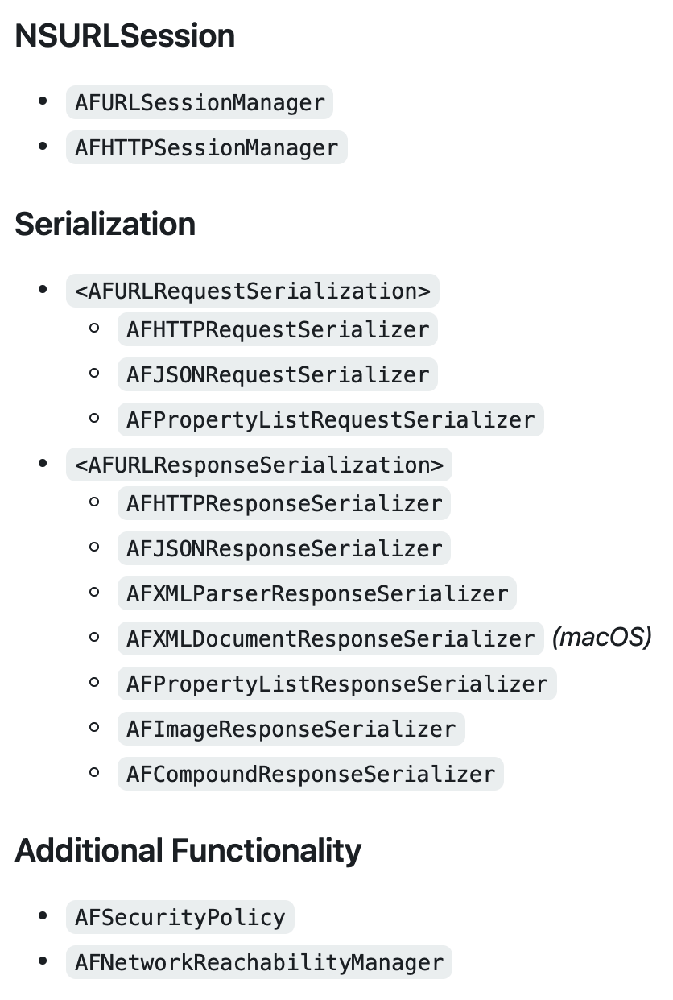
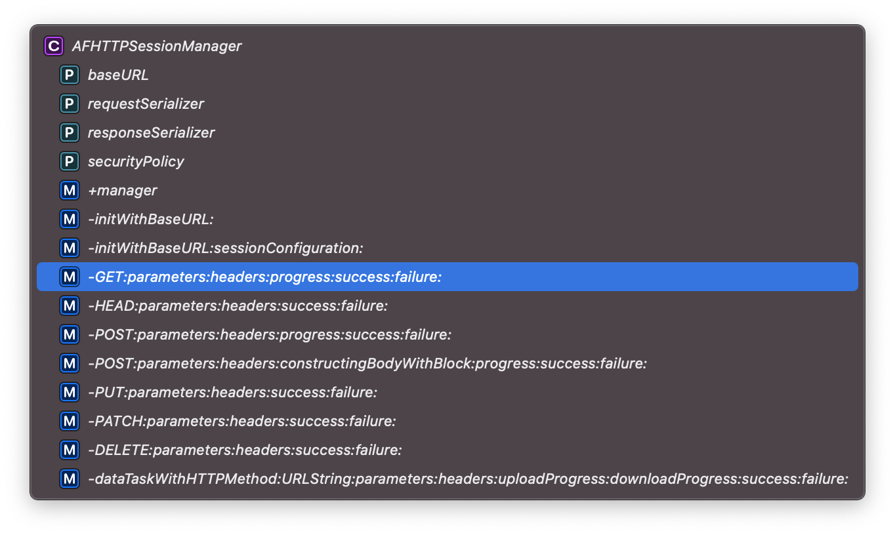

  - AFNetworking (4.0.1):
    - AFNetworking/NSURLSession (= 4.0.1)
    - AFNetworking/Reachability (= 4.0.1)
    - AFNetworking/Security (= 4.0.1)
    - AFNetworking/Serialization (= 4.0.1)
    - AFNetworking/UIKit (= 4.0.1)

  - AFNetworking/NSURLSession (4.0.1):
    - AFNetworking/Reachability
    - AFNetworking/Security
    - AFNetworking/Serialization
  - AFNetworking/Reachability (4.0.1)
  - AFNetworking/Security (4.0.1)
  - AFNetworking/Serialization (4.0.1)
  - AFNetworking/UIKit (4.0.1):
    - AFNetworking/NSURLSessionTaskMetrics
pod 上管理的结果：

AFHTTPSessionManager : AFURLSessionManager 继承关系，并且是主要的类。 
// http的请求的时候， url的请求的时候

_______
<h1>AFHTTPSessionManager 的内容 </h1>

baseURL: 基本的url ，同一个请求前面的部分完全是一样的， baseURL 从名字能够理解， 可以看NSURL.md这个文件的解释
requestSerializer : 这个是请求组参数系列化 ， 
responseSerilizer ：响应的参数系列化， 为什么需要这个？
securityPolicy ： 这个是安全策略 ， 如果是根的服务器单向验证，默认是支持https的
manager ： 单例的一个对象

// 同样一个manager，但是里面的配置会重新设置
initWithBaseURL: 初始化的url
initWithBaseURL:sessionConfiguration:  url  和回话的的配置

get、head、post、push、patch、delete 以及底部最为基本的方法， 实现了基本的请求

————————
Serialization
//总共也就是三种请求系列化
AFHTTPRequestSerializer
AFJSONRequestSerializer : AFHTTPRequestSerializer
AFPropertyListRequestSerializer : AFHTTPRequestSerializer

